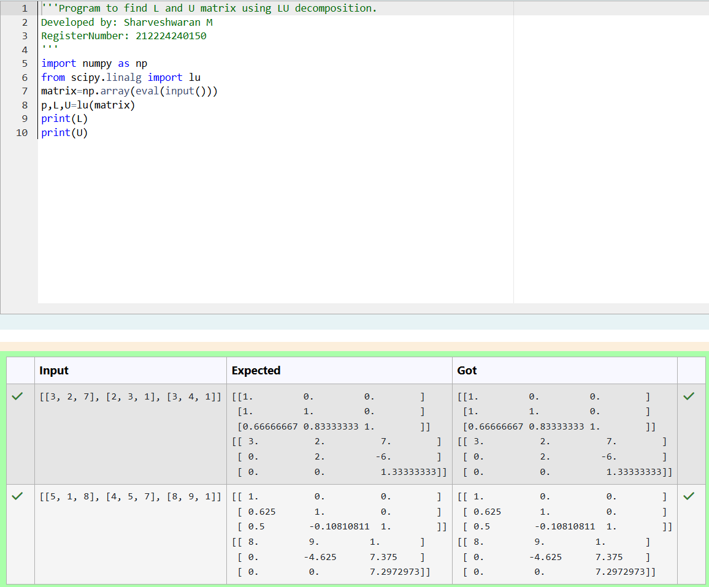
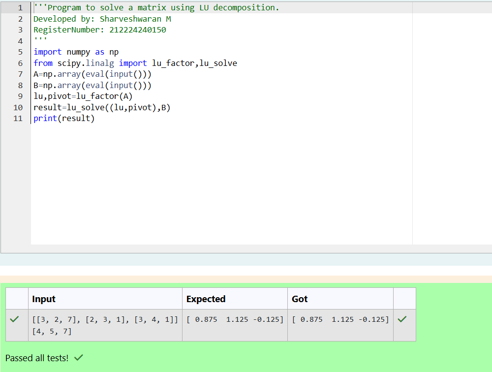

# LU Decomposition 

## AIM:
To write a program to find the LU Decomposition of a matrix.

## Equipments Required:
1. Hardware – PCs
2. Anaconda – Python 3.7 Installation / Moodle-Code Runner

## Algorithm
### Step 1: Import required libraries numpy and scipy.linalg.

### Step 2: Input the matrix/matrices using eval(input()).

### Step 3: Perform LU decomposition using lu() or solve equations using lu_factor() and lu_solve().

### Step 4: Print the results L and U matrices or solution X matrix

## Program:
(i) To find the L and U matrix
```python
'''Program to find L and U matrix using LU decomposition.
Developed by: Sharveshwaran M
RegisterNumber: 212224240150
'''
import numpy as np
from scipy.linalg import lu
matrix=np.array(eval(input()))
p,L,U=lu(matrix)
print(L)
print(U)
```
(ii) To find the LU Decomposition of a matrix
```python
'''Program to solve a matrix using LU decomposition.
Developed by: Sharveshwaran M
RegisterNumber: 212224240150
'''
import numpy as np
from scipy.linalg import lu_factor,lu_solve
A=np.array(eval(input()))
B=np.array(eval(input()))
lu,pivot=lu_factor(A)
result=lu_solve((lu,pivot),B)
print(result)
```

## Output:





## Result:
Thus the program to find the LU Decomposition of a matrix is written and verified using python programming.

